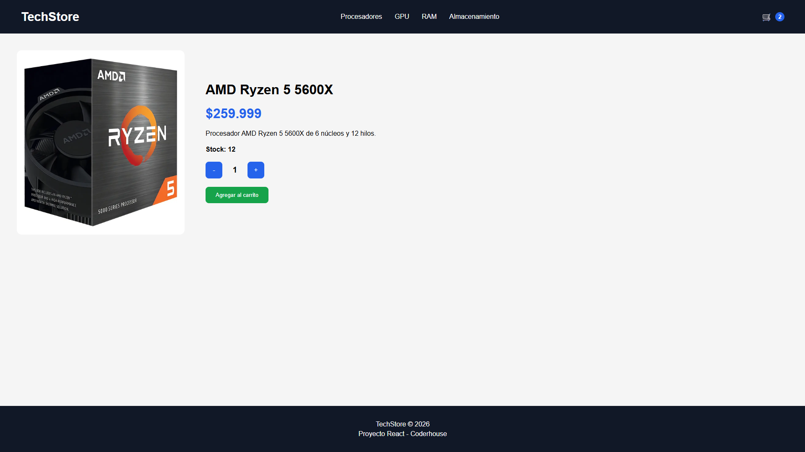

# React E-Commerce

A modern and responsive e-commerce application built with React. Users can browse products, filter them by category, view product details and manage a shopping cart with a smooth and intuitive experience.

# Features

- Browse products
- Filter products by category
- Product detail page
- Shopping cart management
- Add and remove products
- Quantity management
- Firebase Firestore integration
- Responsive design

# Built With

- React
- Vite
- JavaScript
- CSS3
- React Router
- Context API
- Firebase Firestore

# Preview



# Live Demo

pendiente

# Installation

Clone the repository

```bash
git clone https://github.com/thomas-centurion/REPOSITORY_NAME.git
```

Install dependencies

```bash
npm install
```

Run the development server

```bash
npm run dev
```

Build for production

```bash
npm run build
```

# Contact

- LinkedIn: https://www.linkedin.com/in/thomascenturion/
- Email: tcenturion.dev@gmail.com